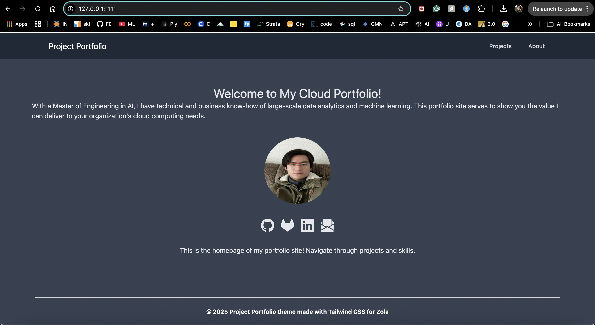

# Project Portfolio Theme Example

I was able to finally deploy it but for some reason, the styling was not correctly rendered and now the templates are shown in raw form.
However, locally, I was able to get it set up, looking quite neat:

[]

Here's the less desirable version:
https://zippy-hummingbird-768d3d.netlify.app/
